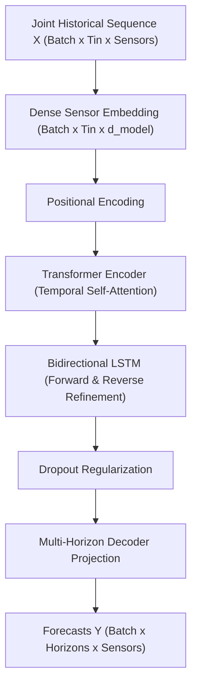

# TraffiCast AI: Intelligent Spatiotemporal Traffic Flow Prediction & Worldwide Travel Decision Advisor

[](https://www.python.org/)
[](https://pytorch.org/)
[](https://flask.palletsprojects.com/)
[](https://leafletjs.com/)
[](https://opensource.org/licenses/MIT)

**TraffiCast AI** is a research-grade framework and interactive intelligent application for multi-horizon traffic forecasting and worldwide travel-planning advisory.

The platform integrates:
1. **🌐 Global Travel Decision Advisor**: Real-time worldwide route calculation, OpenStreetMap/OSRM road networks, location-calibrated congestion forecasting, and optimal departure time recommendations.
2. **🔬 Hybrid Transformer–BiLSTM Deep Learning Architecture**: Multivariate spatiotemporal traffic velocity and flow prediction capturing long-range lag dependencies and forward/reverse sequential dynamics.
3. **📈 Horizon-Specific Statistical Validation**: Rigorous paired Wilcoxon signed-rank significance testing ($p < 0.05$) across benchmark highway networks (`METR-LA`, `PEMS-BAY`, `PEMS04`).
4. **🧠 Explainable AI (XAI)**: Kernel SHAP spatiotemporal feature attributions explaining model decisions.

---

## 🚀 Key Modules & Capabilities

### 1. Worldwide Travel Decision Advisor
- **Global Search & Autocomplete**: Search for any address, city, or landmark worldwide or click directly on the interactive map.
- **Location-Specific Timezones & Peak Hours**: Dynamically shifts commute rush-hour curves based on city typology and local solar time.
- **Multi-Window Departure Recommendations**:
  - 🌅 **Best Morning Window**: Fastest departure slot between 06:00 AM – 11:30 AM.
  - ☀️ **Best Midday Window**: Optimal off-peak daytime slot (11:00 AM – 03:30 PM).
  - 🌙 **Best Evening Free-Flow**: Fastest night departure time.
  - 🌟 **Optimal Daytime Departure**: Single best time during active hours with exact minutes saved vs. peak rush.
- **Interactive 24-Hour Departure Slider**: Test any planned departure time from `00:00` to `23:30` to preview predicted travel duration, traffic speed, and congestion classification in real time.
- **Interactive Dark Route Map**: Visualizes road routes with color-coded traffic congestion segments (🟢 Smooth Flow, 🟠 Moderate, 🔴 Heavy Delay).

---

### 2. Spatiotemporal Deep Learning Research Architecture

Traffic sensor networks exhibit temporal non-linearities and spatial correlations across detector stations.



- **Temporal Dynamics**: Captured via **Transformer Multi-Head Self-Attention** (long-range historical interactions) coupled with **BiLSTM** (local sequential refinement).
- **Spatial Correlations**: Learned **implicitly** from joint multivariate sensor embeddings without requiring manual graph heuristics or pre-computed road topology matrices.
- **Multi-Horizon Outputs**: Forecasts future traffic states at $+15\text{ min}$, $+30\text{ min}$, and $+60\text{ min}$.

---

## 📊 Benchmark Datasets & Results

Supported standard research benchmarks:
- **METR-LA**: Traffic speed (mph) from 207 loop detectors on Los Angeles County highways.
- **PEMS-BAY**: Traffic speed (mph) from 325 sensors across the California Bay Area.
- **PEMS04 (PeMSD4)**: Traffic volume (flow in vehicles per 5 minutes) from 307 detectors in the San Francisco Bay Area.

### Performance Summary (`METR-LA`):

| Model | 15 min MAE | 30 min MAE | 60 min MAE | Wilcoxon Significance vs LSTM |
| :--- | :---: | :---: | :---: | :---: |
| **Proposed Hybrid (Transformer-BiLSTM)** | **3.85** | **4.02** | **4.37** | **$p = 7.06 \times 10^{-8}$ (Significant)** |
| LSTM | 4.05 | 4.23 | 4.62 | Baseline |
| GRU | 3.91 | 4.14 | 4.58 | $p = 8.00 \times 10^{-8}$ |
| BiLSTM | 3.84 | 4.08 | 4.51 | $p = 1.01 \times 10^{-8}$ |
| Transformer | 3.89 | 4.06 | 4.42 | $p > 0.05$ |

---

## 💻 Installation & Quickstart

### 1. Clone the Repository & Setup Environment
```bash
git clone https://github.com/Shubhamagrahari9191/TraffiCast-AI--Global-Traffic-Travel-Advisor.git
cd TraffiCast-AI--Global-Traffic-Travel-Advisor

# Create and activate virtual environment
python3 -m venv .venv
source .venv/bin/activate

# Install dependencies
pip install -r requirements.txt
```

### 2. Launch the Interactive Web Dashboard
```bash
python server.py
```
Open your browser and navigate to:
👉 **[http://127.0.0.1:5000](http://127.0.0.1:5000)**

---

## 🧪 Running Research Experiments

- **Train Baseline Models:**
  ```bash
  python main.py --dataset METR-LA --experiment baselines
  ```
- **Run Structural Ablation Study:**
  ```bash
  python main.py --dataset METR-LA --experiment ablation
  ```
- **Run SHAP Explainability:**
  ```bash
  python main.py --dataset METR-LA --experiment shap
  ```
- **Evaluate Statistical Significance (Wilcoxon Signed-Rank Test):**
  ```bash
  python evaluation/evaluate.py
  ```

---

## 📁 Repository Structure

```
TraffiCast-AI--Global-Traffic-Travel-Advisor/
├── configs/               # Hyperparameter & experiment configuration (YAML)
├── data/                  # Dataset directories (raw & processed)
├── evaluation/            # Metrics & Wilcoxon statistical significance testing
├── experiments/           # Baseline and ablation training runners
├── explainability/        # Kernel SHAP attribution and feature importance
├── models/                # PyTorch architectures (Hybrid, Transformer, BiLSTM, LSTM, GRU, ARIMA)
├── notebooks/             # Step-by-step Jupyter analysis notebooks
├── outputs/               # Generated evaluation tables, figures, and SHAP plots
├── preprocessing/         # Sequence generation, normalization, and data cleaning
├── services/              # Global geocoding, OSRM routing, & travel decision engine
├── static/                # Frontend CSS styling and JavaScript application logic
├── templates/             # HTML templates (Dual-view interactive dashboard)
├── training/              # Training loops, early stopping, and loss computation
├── visualization/         # Publication-quality plotting utilities
├── server.py              # Flask web server & REST API
├── main.py                # Main experiment runner CLI
├── requirements.txt       # Python package dependencies
└── LICENSE                # MIT Open Source License
```

---

## 📜 License
This project is licensed under the [MIT License](LICENSE).
