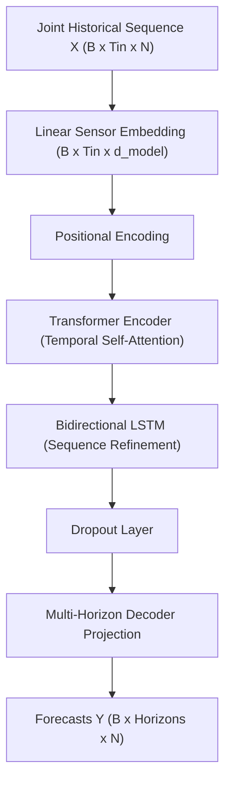

# Intelligent Traffic Flow Prediction Using Hybrid Transformer–BiLSTM and Explainable AI

This repository contains a reproducible, research-grade framework for multi-horizon traffic flow and volume forecasting:
**Hybrid Transformer-BiLSTM for multivariate spatiotemporal traffic forecasting with implicit cross-sensor dependency learning and SHAP-based explainability.**

---

## 1. Project Overview & Research Architecture

Accurate traffic forecasting is essential for intelligent transportation systems (ITS), dynamic signal control, and congestion mitigation. Traffic sensor networks exhibit complex temporal non-linearities and spatial correlations across detector stations.

### Spatiotemporal Modeling Paradigm
- **Temporal Dynamics**: Modeled via **Transformer Temporal Self-Attention** (capturing long-range lag dependencies) coupled with a **Bidirectional Long Short-Term Memory (BiLSTM)** network (capturing forward and reverse sequential dynamics).
- **Spatial Correlations**: Learned **implicitly** from the joint multivariate sensor representations. At each historical timestep, the readings of all $N$ network sensors are mapped simultaneously via a dense linear embedding into the model dimension $d_{model}$.
- **Explicit Road Topology**: An explicit road network graph, adjacency matrix, or Graph Neural Network (GNN / GCN / STGCN / DCRNN) is **not** used. The network discovers spatial correlations directly from the data in an end-to-end manner.



---

## 2. Mathematical Formulation

Given a joint sequence of historical traffic measurements across $N$ detector sensors over an input window of $T_{in}$ timesteps:
$$X = [x_{t-T_{in}+1}, \dots, x_t] \in \mathbb{R}^{T_{in} \times N}$$
the objective is to predict traffic states at future horizons $T_{out} = [t+15\text{ min}, t+30\text{ min}, t+60\text{ min}]$.

Assuming standard 5-minute sampling:
- Input history: $T_{in} = 12$ steps (60 minutes).
- Forecast horizons: Step offsets $+3$ (15 min), $+6$ (30 min), and $+12$ (60 min).

---

## 3. Supported Benchmark Datasets

The repository supports standard research benchmarks for both traffic speed and traffic volume:
1. **METR-LA**: Traffic speed (mph) collected from 207 loop detectors on Los Angeles County highways.
2. **PEMS-BAY**: Traffic speed (mph) collected from 325 sensors across the California Bay Area.
3. **PEMS04 (PeMSD4)**: Traffic volume (flow in vehicles per 5 minutes) from 307 loop detectors in the San Francisco Bay Area.

### File Placement:
```bash
traffic-flow-prediction/
└── data/
    └── raw/
        ├── METR-LA/   # metr-la.h5 or metr-la.npz
        ├── PEMS-BAY/  # pems-bay.h5 or pems-bay.npz
        └── PEMS04/    # PEMS04.npz (Channel 0: flow/volume)
```

---

## 4. Evaluation & Statistical Methodology

To guarantee scientific validity and prevent methodological errors:

1. **Horizon-Specific Statistical Significance**:
   - The Wilcoxon signed-rank test is conducted **separately for each forecast horizon** (15 min, 30 min, 60 min) rather than flattening across all horizons.
   - Evaluates the paired absolute error differences:
     $$D = |\text{Error}_{\text{baseline}}| - |\text{Error}_{\text{proposed}}|$$
   - One-sided alternative hypothesis: Median difference $D > 0$ (Proposed Hybrid achieves systematically smaller errors).
   - Paired observations preserve timestamp and sensor alignment. For computational tractability, a reproducible subsample ($N=10,000$, seed=42) is evaluated.

2. **Sampled Rolling ARIMA Protocol**:
   - Rolling ARIMA across hundreds of sensors over thousands of test steps requires millions of individual model fits ($>10^6$).
   - To make evaluation computationally feasible, ARIMA parameters are estimated once per sensor, and rolling predictions are sampled at configurable intervals (`step_size: 50`).
   - Any numerical convergence failures falling back to naive persistence are audited, logged, and disclosed in `outputs/tables/arima_fallback_statistics_{dataset}.json`.

3. **Representative SHAP Explainability**:
   - Continuous spatiotemporal Kernel SHAP requires evaluating permutations across all $T_{in} \times N$ inputs.
   - For computational feasibility, SHAP is computed on a representative test subset with a bounded background dataset and fixed seed (42).
   - All plots are labeled with their representative sensor ID and horizon (15 min) to maintain scientific transparency.

4. **Visual Timeline vs. Single Forecasts**:
   - The dashboard renders approximately 288 consecutive test steps (24 hours of 5-minute data) as an evaluation timeline window. This represents sequential rolling forecasts, not a single 24-hour ahead prediction.

---

## 5. Execution Commands

### Train Baselines:
```bash
.venv/bin/python main.py --dataset METR-LA --experiment baselines
.venv/bin/python main.py --dataset PEMS04 --experiment baselines
```

### Run Ablation Study:
```bash
.venv/bin/python main.py --dataset METR-LA --experiment ablation
.venv/bin/python main.py --dataset PEMS04 --experiment ablation
```

### Run SHAP Explainability:
```bash
.venv/bin/python main.py --dataset METR-LA --experiment shap
.venv/bin/python main.py --dataset PEMS04 --experiment shap
```

### Evaluate Statistical Significance (Horizon-Specific Wilcoxon):
```bash
.venv/bin/python evaluation/evaluate.py
```

### Launch Interactive Research Dashboard:
```bash
.venv/bin/python server.py
# Access http://127.0.0.1:5000 in your browser
```

---

## 6. Directory Outputs
- `outputs/predictions/`: Raw prediction and ground-truth arrays (`.npy`) for all models.
- `outputs/tables/`:
  - `baseline_results_{dataset}.csv`: MAE, RMSE, MAPE, sMAPE per horizon.
  - `statistical_significance_{dataset}.csv`: Horizon-specific Wilcoxon statistics and p-values.
  - `ablation_results_{dataset}.csv`: Structural ablation findings.
  - `arima_fallback_statistics_{dataset}.json`: Fallback audit report.
- `outputs/figures/`: Publication-quality comparison charts, error distributions, and SHAP plots.
